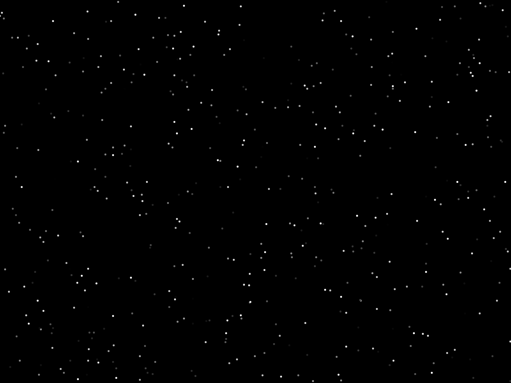

# Tutoriais da Demoscene

Série de tutoriais com efeitos da época de ouro dos demos (demoscene).

Exemplos tirados deste tutorial:

https://www.flipcode.com/archives/The_Art_of_Demomaking-Issue_02_Introduction_To_Computer_Graphics.shtml

## Exemplo #1 - Starfield

Explicação: https://www.flipcode.com/archives/The_Art_of_Demomaking-Issue_02_Introduction_To_Computer_Graphics.shtml

